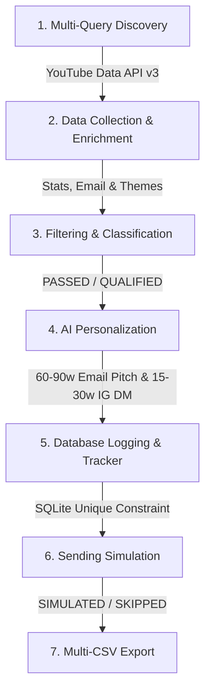

# Automated Micro-Influencer Outreach System

> **Production-Quality Prototype for EDXSO AI Engineer Intern Technical Assignment**

An automated, end-to-end system designed to discover, filter, enrich, personalize, simulate sending, and track outreach for micro-influencers in the **Technology / AI / Developer** niche using the official YouTube Data API v3, LLM-based structured personalization, SQLite database persistence, and programmatic safety controls.

---

## 🛑 Data Authenticity & Safety Commitment

> **CRITICAL COMPLIANCE NOTICE:**
> **"No fabricated influencer information, guessed email addresses, or fake engagement metrics are used."**
> - **Zero Synthetic Data:** All creators, subscriber counts, view statistics, descriptions, and video titles are retrieved live from YouTube Data API v3.
> - **Strict Email Policy:** Email addresses are **NEVER guessed or generated** (e.g. no `contact@...` or `hello@...`). Regex extraction is applied strictly to public channel and video descriptions. If no email is explicitly published, the record stores `"Not Found"`.
> - **Safety-First Sending Layer:** Outbound emails are never dispatched automatically. The system defaults to `SIMULATE_SEND=true`.
> - **Zero Secret Leaks:** API keys and credentials are strictly loaded via `.env` and ignored by `.gitignore`.

---

## 🚀 Key Features & Pipeline Stages

The system operates across **7 distinct modular pipeline stages**:



1. **Discovery:** Multi-query search across 10 technology & AI queries with API pagination and channel ID deduplication to retrieve 50+ real micro-influencer channels.
2. **Data Collection & Enrichment:** Fetches channel statistics, uploads playlists, recent video performance metrics (views, likes, comments), extracts verified public emails via regex, and determines content themes.
3. **Filtering & Classification:** Evaluates creators against configurable micro-influencer bounds (5,000–100,000 subscribers, $\ge 1.0\%$ engagement rate, and technology relevance). Every record receives a `filter_status` (`QUALIFIED` or `FAILED`) and detailed `filter_reason`.
4. **AI Personalization:** Leverages LLM structured output to generate personalized **Email Collaboration Pitches (60–90 words)** and **Instagram DMs (15–30 words)** backed by programmatic word count validation and strict factual grounding ("Use ONLY supplied facts").
5. **Database Logging:** SQLite persistence (`outreach_log`) with a composite `UNIQUE(influencer_name, email)` constraint to prevent duplicate outreach.
6. **Sending Layer Simulation:** Safe execution layer supporting `SIMULATED`, `SKIPPED_NO_EMAIL`, and `SKIPPED_DUPLICATE` statuses.
7. **CSV Exporting:** Generates structured CSV outputs (`influencers.csv`, `classified_influencers.csv`, `qualified_influencers.csv`, `personalized_outreach.csv`, `outreach_tracker.csv`).

---

## 📊 Engagement Rate Calculation Methodology

YouTube Data API v3 does **not** provide a single native influencer engagement rate field. Therefore, this system calculates an **approximate engagement rate** across recent public videos:

$$\text{Video Engagement Rate} = \frac{\text{Likes} + \text{Comments}}{\text{Views}} \times 100$$

$$\text{Channel Engagement Rate} = \text{Mean}(\text{Video Engagement Rates across recent videos})$$

* **Documentation Note:** This is an **APPROXIMATE engagement rate** derived from public statistics. If a channel has insufficient recent public video statistics or zero views, `engagement_rate` is set to `"Not Found"` rather than zero.

---

## 🛠️ Project Structure

```
edxso_ai_influencer_outreach/
├── app/
│   ├── __init__.py           # Package initializer
│   ├── config.py             # Environment configuration & validations
│   ├── youtube_client.py     # Official YouTube Data API v3 wrapper
│   ├── discovery.py          # Multi-query channel discovery & deduplication
│   ├── enrichment.py         # Profile enrichment, email regex & themes
│   ├── filtering.py          # Micro-influencer filtering & classification
│   ├── personalization.py    # LLM pitch & DM generator with word validation
│   ├── outreach.py           # Simulated sending layer & duplicate check
│   ├── db.py                 # SQLite Database Manager (outreach_log)
│   └── pipeline.py           # 7-stage orchestrator & CSV exporter
├── data/                     # Output directory for CSV files & SQLite DB
│   └── .gitkeep
├── tests/                    # Comprehensive Pytest test suite
│   ├── test_email_extraction.py
│   ├── test_engagement.py
│   ├── test_filtering.py
│   ├── test_deduplication.py
│   └── test_word_count.py
├── run.py                    # Main CLI entry point
├── requirements.txt          # Dependencies
├── .env.example              # Environment variables template
├── .gitignore                # Git safety rules
└── README.md                 # System documentation
```

---

## ⚙️ Environment Variables & Configuration

Copy `.env.example` to `.env` and populate your API credentials:

```bash
cp .env.example .env
```

```env
# YouTube Data API Credentials
YOUTUBE_API_KEY=your_youtube_api_key_here

# LLM Credentials (OpenAI or Gemini)
OPENAI_API_KEY=your_openai_api_key_here
OPENAI_MODEL=gpt-4o-mini

# Optional: Gemini API Key
GEMINI_API_KEY=your_gemini_api_key_here
GEMINI_MODEL=gemini-2.5-flash

# Configurable Thresholds
MIN_SUBSCRIBERS=5000
MAX_SUBSCRIBERS=100000
MIN_ENGAGEMENT_RATE=1.0

# Discovery Settings
TARGET_DISCOVERY_COUNT=60
RECENT_VIDEO_COUNT=5

# Safety Controls
SIMULATE_SEND=true
DB_PATH=data/outreach.db
```

---

## 💻 Installation & Usage Instructions

### 1. Prerequisites
- Python 3.10+
- Google YouTube Data API v3 Key (from Google Cloud Console)
- OpenAI or Gemini API Key (optional; falls back to factual mock mode if unconfigured)

### 2. Install Dependencies
```bash
pip install -r requirements.txt
```

### 3. Run Unit Tests
```bash
pytest -v
```

### 4. Run the Pipeline
```bash
python run.py
```

---

## 📺 Demonstration Output Example

When running `python run.py`, the console displays a step-by-step progress monitor:

```text
============================================================
 AUTOMATED MICRO-INFLUENCER OUTREACH PIPELINE 
============================================================

[1/7] Discovering creators...
Searching query: 'AI tools'
Searching query: 'Python programming'
Discovered: 60 unique channels

[2/7] Enriching profiles...
Enriching details for 60 channels...
Records saved: 60

[3/7] Filtering...
Filtering creators (Subscribers: 5,000-100,000, Min Engagement: 1.0%)...
Total Classified: 60 | Qualified: 14 | Failed: 46

[4/7] Generating AI messages...
Generated personalized messages for 14 qualified creators

[5/7] Creating tracker & checking database duplicates...
[6/7] Simulating sending...
[SIMULATED EMAIL SENT] To: Tech Explorer <contact@example.com> | Pitch: Hi Tech Explorer...
Simulated Send Summary -> Sent: 4 | Skipped (No Email): 10 | Skipped (Duplicate): 0

[7/7] Exporting tracker...
Exported final tracker to data/outreach_tracker.csv

DONE
============================================================
```

---

## ⚡ Error Handling & Resiliency

The system implements defensive error handling across all integration points:

- **API Quota Exceeded:** Catches YouTube API HTTP 403 `quotaExceeded` errors and raises `QuotaExceededError` with clear terminal guidance.
- **Missing API Keys:** Validates key presence prior to execution and raises `MissingAPIKeyError`.
- **Invalid LLM JSON:** Retries parsing and cleans markdown code blocks (` ```json `).
- **Word Count Violations:** Programmatically validates email pitches ($60 \le w \le 90$) and Instagram DMs ($15 \le w \le 30$). Re-prompts the LLM with word count feedback on failures.
- **Duplicate Outreach:** SQLite composite UNIQUE constraint enforces idempotent runs.

---

## 🔒 Security & Privacy Considerations

1. **No API Key Commits:** `.env` is listed in `.gitignore`.
2. **No Real Email Dispatch:** `SIMULATE_SEND=true` is hardcoded as default.
3. **No Web Scraping Violations:** All data is obtained strictly via official YouTube v3 REST endpoints.

---

## 📈 Scalability Design

- **Batch Requesting:** Channel details and video statistics are fetched in optimal batches of 50 IDs per network call.
- **Deduplication:** Channel IDs are indexed in a set during discovery before enrichment to minimize API quota usage.
- **Decoupled Architecture:** Clean separation between API client, discovery, enrichment, filtering, AI personalization, database, and pipeline services allows easy expansion to other platforms (e.g., Twitch, X/Twitter).

---

## 📋 Assignment Requirement Mapping

| Requirement | Implementation Module | Verification Status |
| :--- | :--- | :--- |
| **Real Micro-Influencers (50+)** | `app/discovery.py` | Verified via YouTube API |
| **No Data Fabrication** | `app/enrichment.py` | Strict API & regex sourcing |
| **Subscriber Range (5k-100k)** | `app/filtering.py` | Configurable in `.env` |
| **Filter Status & Reason** | `app/filtering.py` | Records `QUALIFIED` & `FAILED` reasons |
| **Engagement Rate Calc** | `app/enrichment.py` | Video mean formula with "Not Found" support |
| **Regex Email Extraction** | `app/enrichment.py` | Strict regex; no guessing |
| **Content Themes** | `app/enrichment.py` | Keyword matching on real titles/descriptions |
| **AI Personalization (60-90w / 15-30w)**| `app/personalization.py` | LLM JSON output + word count validator |
| **SQLite Duplicate Prevention** | `app/db.py`, `app/outreach.py` | `UNIQUE(influencer_name, email)` |
| **Simulated Sending Layer** | `app/outreach.py` | Safe simulation mode |
| **5 CSV Outputs** | `app/pipeline.py` | Exported to `data/` |
